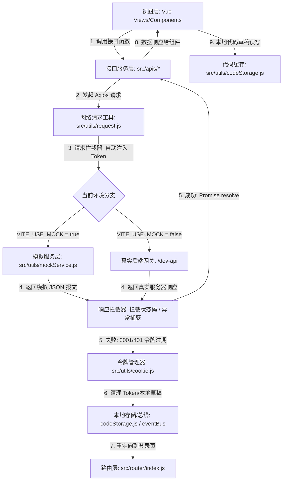

# CodeFlow Online Judge 前端项目架构设计文档

本文档详述了 CodeFlow Online Judge 前端项目（以下简称 `oj-c`）的整体系统架构、目录结构、模块依赖、核心业务流向、路由设计、数据流向以及编译构建规范，为团队研发人员提供全局架构视角。

---

## 1. 目录结构与架构模块

项目基于 **Vue 3 (Composition API)** + **Vite 6** 进行构建，采用标准前端模块化分层开发。

### 1.1 目录结构拓扑

```text
oj-c/
├── .env.development.local  # 本地开发环境变量配置
├── .gitignore              # Git 忽略配置
├── index.html              # 应用单页面入口 HTML
├── jsconfig.json           # VSCode 路径别名 (@/) 与代码自动提示配置
├── package.json            # 依赖包及脚本管理
├── vite.config.js          # Vite 核心构建与反向代理配置
├── docs/                   # 项目企业级技术文档库（当前目录）
├── public/                 # 静态资源目录（无需编译）
└── src/                    # 源码主目录
    ├── App.vue             # 根组件
    ├── main.js             # 应用入口 JS，初始化 Vue 实例与全局插件
    ├── apis/               # API 接口层（按业务模块划分）
    │   ├── exam.js         # 竞赛与考试模块相关接口
    │   ├── message.js      # 用户系统消息相关接口
    │   ├── question.js     # 题库与刷题相关接口
    │   └── user.js         # 用户认证、个人中心与代码提交接口
    ├── assets/             # 静态资产编译目录
    │   ├── main.scss       # 全局样式文件（含设计系统 Token 与玻璃微瑕样式）
    │   └── oj-logo.svg     # 品牌 Logo
    ├── components/         # 全局复用公共组件
    │   ├── CodeEditor.vue       # 基于 Ace Editor 封装的在线代码编辑器
    │   ├── NavBar.vue           # 拟物化悬浮式导航 Dock 栏
    │   └── QuestionSelector.vue # 题库难度筛选器自定义组件
    ├── data/               # 静态或本地配置数据定义
    ├── router/             # 路由配置层
    │   └── index.js        # Vue Router 静态与动态嵌套路由规则
    ├── utils/              # 通用工具函数库
    │   ├── codeStorage.js  # 本地代码草稿箱机制管理（localStorage）
    │   ├── cookie.js       # 用户认证令牌管理（js-cookie）
    │   ├── eventBus.js     # 基于 mitt 机制的轻量级全局事件总线
    │   ├── mockService.js  # 纯前端模拟 API 响应层（支持无后端预览）
    │   ├── request.js      # 基于 Axios 封装的网络请求客户端（含双向拦截器）
    │   └── studyPlan.js    # 用户学习路线与计划本地追踪
    └── views/              # 页面级视图组件（按业务域划分）
        ├── Login.vue       # 统一身份认证与登录页
        ├── Home.vue        # 门户主框架与统计看板布局页
        ├── Question.vue    # 核心题库列表与每日一题页
        ├── Exam.vue        # 竞赛大厅与积分排行榜页
        ├── ContestDetail.vue      # 单场竞赛详情与考试指南页
        ├── ProblemSetGallery.vue  # 学习路线与专题题单广场页
        ├── ProblemSetDetail.vue   # 单个专题题单进度追踪页
        ├── Answer.vue      # 核心双栏代码编译与在线评测工作台
        ├── ExamResult.vue  # 竞赛提交报告与实时排名展示页
        ├── UserExam.vue    # 我的竞赛列表与历史战绩页
        ├── UserDetail.vue  # 个人信息设置与答题热力图页
        └── UserMessage.vue # 系统消息与通知中心页
```

---

## 2. 模块通信与数据流向

整个前端系统的层次架构可以分为以下 5 层：**视图层（Views/Components）**、**路由层（Router）**、**应用状态/事件层（Storage/EventBus）**、**网络层（API/Axios）** 和 **构建层（Vite/Webpack）**。

### 2.1 核心数据流向图

下图展示了从用户在视图层触发动作，直至通过网关或 Mock 返回并更新界面的完整生命周期：



### 2.2 组件间通信机制

对于不包含复杂状态的轻量级系统，项目并没有引入 Pinia 或 Vuex，而是采用了 **双轨状态通信方案**：
1. **持久化与响应式双向共享（Local Storage / Cookies）**：
   - 登录凭证（Token）存放于 Cookie 中，使每一次的 Axios 请求拦截器可以同步取得认证头。
   - 用户的临时代码草稿、做题记录缓存于 LocalStorage。
2. **异步跨组件解耦通信（Event Bus）**：
   - 使用自定义的 `eventBus.js` 进行松耦合通信。最典型的场景是 `NavBar.vue` 订阅了 `user-info-updated` 事件。当用户在登录页面成功登录，或者在个人中心退出登录、令牌过期强制下线时，将向 `user-info-updated` 总线广播消息，由导航栏组件触发 `checkLogin` 并实时拉取或清除用户信息。

---

## 3. 路由设计与访问控制

### 3.1 嵌套路由结构

项目主路由结构采用 `Home.vue` 作为嵌套路由的基座，大部分页面作为其子路由懒加载，从而复用全局导航 Dock 栏和页眉。

```mermaid
graph TD
    Root["/ (根路径)"] -->|Redirect| Home["/c-oj/home"]
    Login["/c-oj/login (登录页)"]
    Answer["/c-oj/answer (代码评测台)"]
    Result["/c-oj/exam/result (竞赛结果)"]
    
    subgraph Home Layout [/c-oj/home]
        Q["/question (题库大厅)"]
        E["/exam (竞赛大厅)"]
        PSG["/problem-set-gallery (题单广场)"]
        PSD["/problem-set/:setId (题单详情)"]
        ED["/exam/:examId (竞赛详情)"]
        UE["/user/exam (我的竞赛)"]
        UD["/user/detail (个人中心)"]
        UM["/user/message (消息中心)"]
    end
```

### 3.2 路由元数据 (`meta`) 规范

路由配置项（`src/router/index.js`）中的 `meta` 字典目前定义了页面特性的渲染逻辑：
- `showBanner`: 决定是否在 `Home.vue` 布局页顶端展示拟物化科技感横幅（Banner）。目前仅在 `/c-oj/home/question`（题库）及 `/c-oj/home/exam`（竞赛）两个大厅页面为 `true`，其他嵌套页隐藏以腾出操作空间。

---

## 4. 核心中间件与构建机制

### 4.1 网络请求中间件 `request.js`

Axios 实例配置了严密的拦截器逻辑以应对企业级前后端通信：
- **请求拦截器 (Request Interceptor)**：
  - 自动通过 `getToken()` 提取 Cookie 中的令牌。
  - 若存在 Token，自动在 HTTP Header 中添加 `authentication: Bearer <Token>`。
- **响应拦截器 (Response Interceptor)**：
  - 解包响应体，当后台业务状态码 `code !== 1000` 时判定为业务异常。
  - 特殊状态码捕获：当 `code === 3001` 时，代表 Token 在服务端 Redis 中已过期或无效。此时自动触发 `removeToken()` 移出本地 Cookie，并通过 `ElMessage.error` 提醒用户登录已过期，重定向到登录页面以防止静默轮询导致的死循环。

### 4.2 编译构建与插件集成 (`vite.config.js`)

项目利用了 Vite 的高效开发服务器特性以及自动导入插件：
1. **自动按需加载插件 (Unplugin)**：
   - `unplugin-auto-import/vite`：自动导入 Vue 核心 API（如 `ref`, `computed`, `watch`, `onMounted` 等），开发者无需在每个 `.vue` 文件中手动编写 `import { ref } from 'vue'`。
   - `unplugin-vue-components/vite` 结合 `ElementPlusResolver`：自动解析和引入项目中使用到的 Element Plus UI 组件及其 CSS 文件，有效减小首屏打包体积。
2. **本地代理 (Development Proxy)**：
   - 配置规则 `/dev-api` 到后端网关服务的映射。生产部署时，改用 Nginx 反向代理承担此职责。
