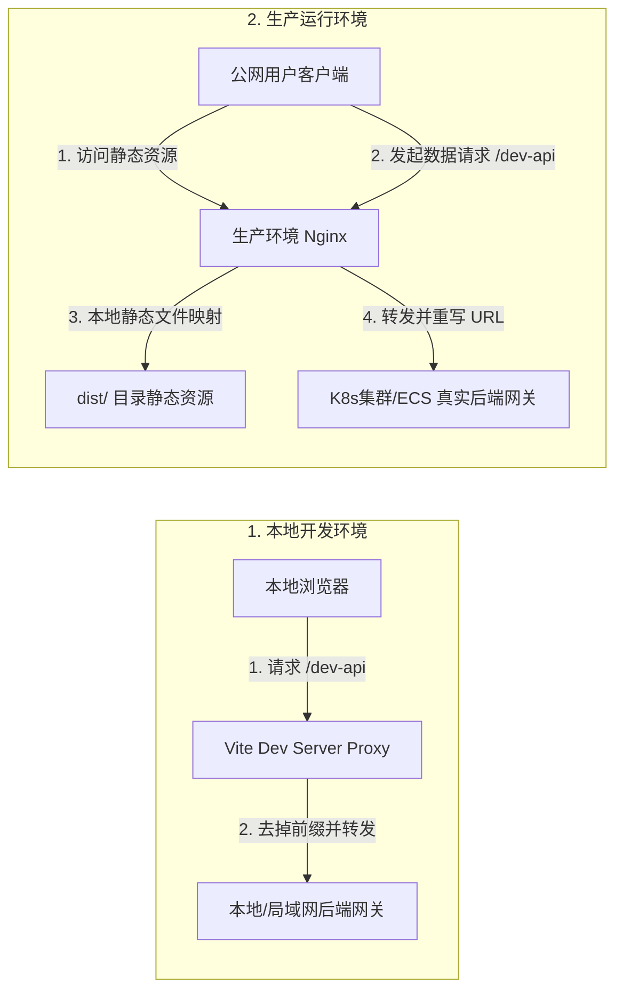

# CodeFlow Online Judge 生产部署与运维指南

本文档为运维团队和研发负责人提供 CodeFlow Online Judge 前端项目（`oj-c`）的生产环境打包、反向代理服务器（Nginx）配置、部署发布、缓存控制以及灾备排查的标准化操作指南。

---

## 1. 运行环境与前置准备

### 1.1 环境节点要求
- **Node.js**：建议使用 `LTS v18` 或更高版本（如 `v20.x`）。
- **npm**：建议使用 `v9.x` 及以上版本（随 Node 一起安装）。
- **Nginx**：生产服务器建议使用 `v1.20` 或更高稳定版，并编译有 `ngx_http_gzip_module`（压缩）和 `ngx_http_ssl_module`（SSL 安全套接字）模块。

### 1.2 依赖项获取与预编译
在部署服务器或 CI/CD 构建节点上，切换到项目根目录执行以下步骤：

```bash
# 1. 校验 Node 运行版本
node -v
npm -v

# 2. 清理缓存并安装依赖
npm ci # 如果 package-lock.json 存在，优先使用 ci 锁定依赖版本安装

# 3. 执行生产环境打包编译
npm run build
```

打包成功后，会在根目录下生成 `dist/` 文件夹。该文件夹包含所有已编译、混淆、分片压缩的静态 HTML、Sass 编译后的 CSS 以及 JS 文件。运维只需将 `dist/` 中的所有文件分发到 Nginx 配置的静态文件路径中。

---

## 2. 前端代理机制对比

由于前端应用与后端 API 通常存在跨域限制，项目在开发与生产环境采取了不同的代理机制：



---

## 3. 企业级 Nginx 配置文件

以下是推荐的 Nginx 配置文件模板。此配置包含 **Vue Router History 模式处理**、**后端网关反向代理**、**SSL 配置**、**Gzip 传输压缩** 以及 **强缓存与协商缓存策略**。

```nginx
# nginx.conf
# 建议在 /etc/nginx/conf.d/ 下为该项目配置单独的虚拟主机文件，例如 codeflow-oj.conf

server {
    listen 80;
    listen [::]:80;
    server_name codeflow.example.com; # 您的域名

    # 强制将所有 HTTP 请求重定向到 HTTPS
    return 301 https://$host$request_uri;
}

server {
    listen 443 ssl http2;
    listen [::]:443 ssl http2;
    server_name codeflow.example.com;

    # 1. SSL 安全配置
    ssl_certificate /etc/nginx/ssl/codeflow.crt;       # 证书公钥路径
    ssl_certificate_key /etc/nginx/ssl/codeflow.key;   # 证书私钥路径
    ssl_session_timeout 1d;
    ssl_session_cache shared:SSL:50m;
    ssl_session_tickets off;

    # 现代 SSL 加密套件配置
    ssl_protocols TLSv1.2 TLSv1.3;
    ssl_ciphers ECDHE-ECDSA-AES128-GCM-SHA256:ECDHE-RSA-AES128-GCM-SHA256:ECDHE-ECDSA-AES256-GCM-SHA384:ECDHE-RSA-AES256-GCM-SHA384:DHE-RSA-AES128-GCM-SHA256:DHE-RSA-AES256-GCM-SHA384;
    ssl_prefer_server_ciphers off;

    # 2. 安全响应头注入
    add_header X-Frame-Options "SAMEORIGIN" always;
    add_header X-XSS-Protection "1; mode=block" always;
    add_header X-Content-Type-Options "nosniff" always;
    add_header Referrer-Policy "no-referrer-when-downgrade" always;
    add_header Content-Security-Policy "default-src 'self' http: https: data: blob: 'unsafe-inline'" always;

    # 静态物理资源根目录映射，指向打好的静态包解压路径
    root /var/www/codeflow/dist;
    index index.html;

    # 3. 开启 Gzip 压缩，减少网络传输流量，优化首屏 LCP 性能
    gzip on;
    gzip_min_length 1k;
    gzip_buffers 4 16k;
    gzip_http_version 1.1;
    gzip_comp_level 5; # 压缩级别 1-9，建议选5在CPU消耗和压缩率之间取得平衡
    gzip_types text/plain text/css application/json application/javascript text/xml application/xml application/xml+rss text/javascript image/svg+xml;
    gzip_vary on;

    # 4. 前端应用主入口及 Vue Router History 模式兼容性配置
    location / {
        # 处理 Vue Router 的 HTML5 History 模式。当用户直接刷新类似 /c-oj/home/question 的路由时，
        # Nginx 找不到该物理文件，若不配置该项会报 404。此配置将其fallback重定向到单页面入口 index.html，交由前端路由解析。
        try_files $uri $uri/ /index.html;
        
        # 对于 index.html 网页入口，不设置强缓存，走协商缓存，每次都向服务器核对版本，防止发布新包后用户浏览器读旧缓存。
        expires -1;
        add_header Cache-Control "no-store, no-cache, must-revalidate, proxy-revalidate, max-age=0";
    }

    # 5. 静态资源强缓存策略（Vite 打包出来的 JS/CSS 带有独特的 Hash 后缀，内容若改变 Hash 必然改变，因此可以放心使用强缓存）
    location /assets/ {
        expires 1y;
        add_header Cache-Control "public, max-age=31536000, immutable";
        access_log off;
    }

    # 6. 后端微服务网关反向代理
    # 所有前端发往 /dev-api 的请求会被转发到后端微服务网关，并去掉 /dev-api 前缀
    location /dev-api/ {
        # 后端网关监听地址与端口
        proxy_pass http://127.0.0.1:19090/friend/; 
        
        # 传递真实请求头信息给后端，防止后端统计 IP 或进行重定向时出现协议、域名混淆
        proxy_set_header Host $host;
        proxy_set_header X-Real-IP $remote_addr;
        proxy_set_header X-Forwarded-For $proxy_add_x_forwarded_for;
        proxy_set_header X-Forwarded-Proto $scheme;

        # 解决 WebSocket 代理支持（若评测平台后期引入了 WS 推送）
        proxy_http_version 1.1;
        proxy_set_header Upgrade $http_upgrade;
        proxy_set_header Connection "upgrade";

        # 调大上传限制，满足用户个人中心可能上传的大分辨率头像/文件包
        client_max_body_size 10m;
        
        # 超时时间设置
        proxy_connect_timeout 60s;
        proxy_read_timeout 120s;
        proxy_send_timeout 120s;
    }

    # 7. 错误页面重定向
    error_page 500 502 503 504 /50x.html;
    location = /50x.html {
        root /usr/share/nginx/html;
    }
}
```

---

## 4. 部署后验证与排查清单 (Verification Checklist)

当静态资源发布及 Nginx 配置重载（`nginx -s reload`）后，运维人员需对以下核心链路进行逐一验证：

### 4.1 首屏加载与资源校验
- 访问配置好的域名，打开浏览器开发者工具（F12），进入 **Network** 面板。
- 刷新页面，确认 `index.html` 的 HTTP 状态码为 `200`（或从协商缓存返回的 `304`）。
- 确认静态 CSS/JS 资源成功加载（无 404 错误），且响应头中包含 `Cache-Control: max-age=31536000, immutable`，`Content-Encoding: gzip` 标志有效。

### 4.2 Vue Router 刷新回退验证
- 在网页中点击进入“竞赛大厅”页面（URL 变为：`https://codeflow.example.com/c-oj/home/exam`）。
- 在此子路径下，点击浏览器刷新按钮。
- **合格标准**：页面能够正常刷新并重新挂载出竞赛大厅，地址栏不变，且无控制台报错。若显示 Nginx 原生 `404 Not Found` 页面，代表 `try_files` 行没有正确在 Nginx 的 `location /` 块中起效。

### 4.3 跨域代理与 Token 传递验证
- 进入登录页，输入测试手机号获取验证码并登录。
- 确认请求 `/user/login` 的实际指向为 `https://codeflow.example.com/dev-api/user/login`，且响应状态码为 200（业务状态码 1000）。
- **合格标准**：浏览器 Cookie 中自动产生 `authentication` 键值，且后续发起的 `/user/info` 请求头中，自动携带 `authentication: Bearer xxxxxx` 请求头。
